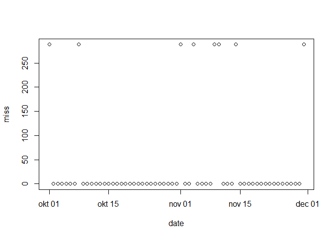
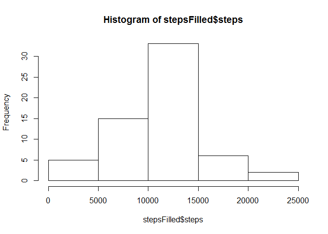
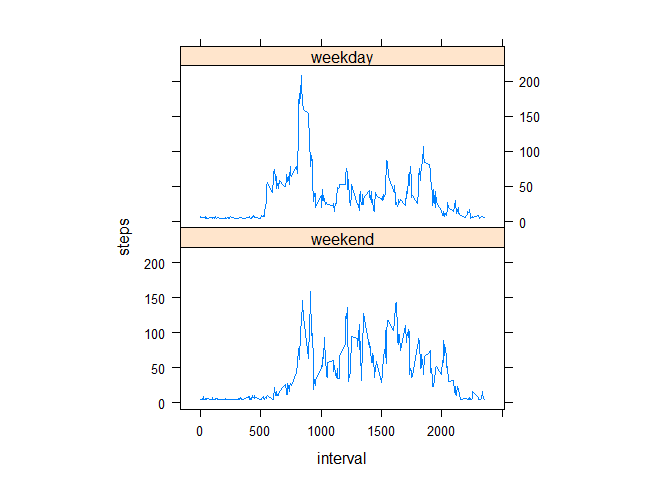

# Reproducible Research: Peer Assessment 1


## Loading and preprocessing the data

```r
setwd("p:/Coursera/reproducibleresearch/RepData_PeerAssessment1")
activity<-read.csv("./activity/activity.csv")
```

### Transform data if necessary

```r
activity$date<-as.Date(activity$date)
stepsTotal<-aggregate(steps~date,data=activity,sum,na.rm=TRUE)
```

## What is mean total number of steps taken per day?

### Histogram

```r
hist(stepsTotal$steps)
```


### Mean

```r
mean(stepsTotal$steps)
```

```
## [1] 10766.19
```

### Median

```r
median(stepsTotal$steps)
```

```
## [1] 10765
```

## What is the average daily activity pattern?
###Timeseries plot

```r
stepsInterval<-aggregate(steps~interval,data=activity,mean,na.rm=TRUE)
plot(steps~interval,data=stepsInterval,type="l")
```


###Most active 5 min interval

```r
stepsInterval[which.max(stepsInterval$steps),]$interval
```

```
## [1] 835
```

## Imputing missing values

### Number of rows with NA

```r
sum(is.na(activity$steps))
```

```
## [1] 2304
```

### Strategy for imputation
First off, I am trying to see if missing values are random or not. Below I've plotted only the "missbydate" variable which calculates the number of missing values pr date. By looking at the missing values, we can derive that the dates with missing values have missing values for all intervals. To confirm this, you may also opt to look at the outcommented code.


```r
library("dplyr")
```

```
## Warning: package 'dplyr' was built under R version 3.2.4
```

```
## 
## Attaching package: 'dplyr'
```

```
## De følgende objekter er maskerede fra 'package:stats':
## 
##     filter, lag
```

```
## De følgende objekter er maskerede fra 'package:base':
## 
##     intersect, setdiff, setequal, union
```

```r
missbydate<-activity%>%group_by(date)%>%summarise(miss=sum(is.na(steps)))
#dateswithmiss<-(missbydate%>%filter(miss!=0))[[1]]
#missbyinterval<-activity%>%filter(date %in% dateswithmiss)%>%group_by(interval)%>%summarise(miss=sum(is.na(steps)))
plot(missbydate)
```


The missing data is NOT missing at random (but rather, missing at specific days across all time intervals). The missing data amounts to 0.4% of the data available - so below the 5% threshold normally accepted for MCAR data. However, this is not the case here.

```r
sum(is.na(activity$steps))/(sum(activity$steps, na.rm=TRUE)+sum(is.na(activity$steps)))*100
```

```
## [1] 0.402156
```

In order to impute missing data, I decide to replace the missing days with data from an "average weekday". I chose this strategy because people are creatures of habit and if the person in question has some sport activity or other, it may very well occur on the same weekdays. I start by creating a function that find the average steps for a given weekday and then use it to impute:

```r
byweekdate<-function(i){meanofweekday<-activity%>%group_by(weekdays(date))%>%summarise(mean=mean(steps, na.rm=TRUE))
meanofweekday$mean[meanofweekday[,1]==as.vector(weekdays(i, abbreviate = FALSE))]}


activityFilled<-activity
count=0           # Count the number of data filled in
for(i in 1:nrow(activityFilled)){
    if(is.na(activityFilled[i,]$steps)){
        activityFilled[i,]$steps<-byweekdate(activityFilled[i,]$date)
        count=count+1
    }
}
cat("Total ",count, "NA values were filled.\n\r") 
```

```
## Total  2304 NA values were filled.
## 
```
### Histogram

```r
stepsFilled<-aggregate(steps~date,data=activityFilled,sum,na.rm=TRUE)
hist(stepsFilled$steps)
```



### Mean

```r
mean(stepsFilled$steps)
```

```
## [1] 10821.21
```

### Median

```r
median(stepsFilled$steps)
```

```
## [1] 11015
```


## Are there differences in activity patterns between weekdays and weekends?
###Create weekday/weekend factor

```r
activityFilled$weekday<-factor(ifelse(weekdays(activityFilled$date) %in% c("lørdag","søndag"),"weekend","weekday"),levels=c("weekend","weekday"))
```
###Create panelplot

```r
stepsInterval2=aggregate(steps~interval+weekday,activityFilled,mean)
library(lattice)
xyplot(steps~interval|factor(weekday),data=stepsInterval2,aspect=1/2,type="l")
```


